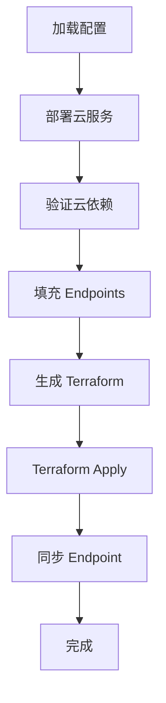

# 依赖声明与引用注入的实现文档

## 文档概述

本文档描述了 deploy-tool 中依赖声明与引用注入功能的具体实现，基于 Terraform 统一部署的方案。该实现利用 Terraform 的 output/input 机制，实现云服务和 Kubernetes 资源间的依赖注入。

**版本**: v1.0.0  
**实现日期**: 2025-11-23  
**基于设计文档**: `prompt/output/terraform-unified-deployment-design.md`

## 一、核心特性

### 1.1 主要功能

✅ **云服务 Terraform Module**
- 为火山引擎 Redis 和 PostgreSQL 创建了标准化的 Terraform 模块
- 每个模块包含 main.tf、variables.tf、outputs.tf
- 支持自动标签管理和等待机制

✅ **引用映射机制**
- 将配置中的 `${ref:...}` 语法转换为 Terraform 模块引用
- 支持云服务 output 的自动注入到 K8s 资源

✅ **依赖管理**
- 通过 `dependencies` 字段声明中间件间的依赖关系
- Terraform 自动处理部署顺序和依赖关系

✅ **统一部署**
- 一次性通过 Terraform apply 部署所有资源
- 云服务和 Kubernetes 资源的统一状态管理

## 二、实现架构

### 2.1 目录结构

```
deploy-tool/
├── terraform/
│   ├── modules/
│   │   ├── cloud/                          # 云服务模块（新增）
│   │   │   └── volcengine/
│   │   │       ├── redis/
│   │   │       │   ├── main.tf
│   │   │       │   ├── variables.tf
│   │   │       │   └── outputs.tf
│   │   │       └── rds-postgresql/
│   │   │           ├── main.tf
│   │   │           ├── variables.tf
│   │   │           └── outputs.tf
│   │   └── kubernetes/                     # K8s 资源模块（已有）
│   │       ├── namespace/
│   │       ├── deployment/
│   │       └── service/
│   └── generated/                          # 生成的配置
│       ├── providers.tf
│       ├── namespace.tf
│       ├── cloud-redis.tf                  # 云服务资源（新增）
│       ├── middleware-centrifugo.tf        # 引用云服务
│       └── component-main.tf
├── src/
│   ├── terraform/
│   │   ├── generator.ts                    # 扩展生成器功能
│   │   └── executor.ts                     # 新增 getOutputs()
│   └── deployer.ts                         # 简化流程
└── tests/
    ├── terraform/
    │   ├── cloud-modules.test.ts           # 云服务模块测试
    │   └── generator.test.ts               # 生成器测试
    └── integration/
        └── deployer-flow.test.ts           # 流程测试
```

### 2.2 核心组件

#### 2.2.1 云服务 Terraform Module

**位置**: `terraform/modules/cloud/volcengine/redis/`

**功能**:
- 定义 Redis 实例资源
- 配置参数化（实例规格、密码、VPC 等）
- 输出 endpoint、port、connection_string 等信息

**关键 Outputs**:
```hcl
output "endpoint" {
  description = "Redis 连接地址"
  value       = volcengine_redis_instance.this.connection_info[0].internal_endpoint
}

output "password" {
  description = "Redis 密码"
  value       = var.password
  sensitive   = true
}
```

#### 2.2.2 TerraformGenerator（扩展）

**位置**: `src/terraform/generator.ts`

**新增方法**:

1. `generateCloudResources()` - 生成云服务资源配置
2. `buildDependencyRefs()` - 构建依赖引用映射
3. `processEnvVarsWithRefs()` - 处理环境变量中的引用
4. `formatEnvVars()` - 格式化为 Terraform HCL

**核心逻辑**:
```typescript
// 1. 识别云服务依赖
if (middleware.deploymentType === 'cloud' && middleware.endpoint) {
  await this.generateCloudResource(/* ... */);
}

// 2. 构建引用映射
const refs = new Map<string, string>();
if (depConfig.deploymentType === 'cloud') {
  const moduleName = `cloud_${depMiddleware.toLowerCase()}`;
  refs.set(`${depPath}.endpoint`, `module.${moduleName}.endpoint`);
}

// 3. 转换环境变量
const envVars = this.processEnvVarsWithRefs(middlewareSpec.env, dependencyRefs);
```

#### 2.2.3 TerraformExecutor（扩展）

**位置**: `src/terraform/executor.ts`

**新增方法**:
```typescript
async getOutputs(): Promise<Record<string, any>> {
  const execResult = await this.execTerraform(['output', '-json']);
  const outputs = JSON.parse(execResult.stdout);
  
  // 转换为简单的键值对
  const resultMap: Record<string, any> = {};
  for (const [key, value] of Object.entries(outputs)) {
    resultMap[key] = (value as any).value;
  }
  
  return resultMap;
}
```

#### 2.2.4 Deployer（简化）

**位置**: `src/deployer.ts`

**部署流程**:
```
1. 加载和验证配置
2. 检测并部署云服务（如果需要）
3. 验证 cloud 类型依赖
4. 填写 container endpoints
5. 生成 Terraform 配置（包含云服务和引用关系）
6. 通过 Terraform 统一部署
7. 从 Terraform output 同步 endpoint
```

**关键改进**:
- 云服务和 K8s 资源通过 Terraform 统一部署
- 自动从 Terraform output 同步 endpoint
- 简化流程，减少手动步骤

## 三、配置示例

### 3.1 Deploy 配置

**deploy.dev.json**:
```json
{
  "provider": "local",
  "environment": "dev",
  "components": {
    "communication": {
      "middlewareDependencies": {
        "redis": {
          "deploymentType": "container",
          "use": "redis",
          "config": {
            "password": "redis123456"
          }
        },
        "centrifugo": {
          "deploymentType": "container",
          "use": "centrifugo",
          "dependencies": ["components.communication.middlewareDependencies.redis"],
          "config": {
            "engine": "redis",
            "redisAddress": "${ref:components.communication.middlewareDependencies.redis.endpoint}",
            "redisPassword": "${ref:components.communication.middlewareDependencies.redis.config.password}"
          }
        }
      }
    }
  }
}
```

### 3.2 生成的 Terraform 配置

**生产环境（cloud-redis.tf）**:
```hcl
# Cloud Resource: redis (redis)
module "cloud_redis" {
  source = "../modules/cloud/volcengine/redis"
  
  resource_name = "lit-prod-redis"
  environment   = "prod"
  region = "cn-beijing"
  password = "redis123456"
}

# Output: 供其他模块引用
output "cloud_redis_endpoint" {
  value = module.cloud_redis.endpoint
}

output "cloud_redis_connection_string" {
  value     = module.cloud_redis.connection_string
  sensitive = true
}
```

**中间件配置（middleware-centrifugo.tf）**:
```hcl
module "middleware_centrifugo" {
  source = "../modules/kubernetes/deployment"

  deployment_name = "centrifugo"
  namespace       = module.namespace.namespace_name
  
  depends_on = [
    module.cloud_redis
  ]
  
  containers = [
    {
      env = [
        {
          name  = "CENTRIFUGO_REDIS_ADDRESS"
          value = module.cloud_redis.endpoint  # Terraform 引用
        },
        {
          name  = "CENTRIFUGO_REDIS_PASSWORD"
          value = module.cloud_redis.password  # Terraform 引用
        }
      ]
    }
  ]
}
```

## 四、引用解析机制

### 4.1 引用语法

**格式**: `${ref:路径}`

**示例**:
- `${ref:components.communication.middlewareDependencies.redis.endpoint}`
- `${ref:components.communication.middlewareDependencies.redis.config.password}`

### 4.2 转换规则

| 引用类型 | 原始引用 | Terraform 引用 |
|---------|---------|---------------|
| Cloud Endpoint | `${ref:components.communication.middlewareDependencies.redis.endpoint}` | `module.cloud_redis.endpoint` |
| Cloud Password | `${ref:components.communication.middlewareDependencies.redis.config.password}` | `module.cloud_redis.password` |
| Container Endpoint | `${ref:components.main.middlewareDependencies.db.endpoint}` | `"db-svc.lit-dev.svc.cluster.local:5432"` (固定值) |

### 4.3 转换流程

```typescript
// 1. 解析依赖路径
const parsed = this.parseDependencyPath(depPath);
// → { componentName: 'communication', middlewareName: 'redis' }

// 2. 获取依赖配置
const depConfig = this.config.components[componentName].middlewareDependencies[middlewareName];

// 3. 根据部署类型生成引用
if (depConfig.deploymentType === 'cloud') {
  const moduleName = `cloud_${middlewareName.toLowerCase()}`;
  refs.set(`${depPath}.endpoint`, `module.${moduleName}.endpoint`);
}

// 4. 处理环境变量
const envVars = this.processEnvVarsWithRefs(middlewareSpec.env, refs);
```

## 五、依赖管理

### 5.1 依赖声明

**配置格式**:
```json
{
  "centrifugo": {
    "deploymentType": "container",
    "dependencies": [
      "components.communication.middlewareDependencies.redis"
    ]
  }
}
```

### 5.2 Terraform depends_on

生成器自动添加 `depends_on`:
```hcl
module "middleware_centrifugo" {
  # ...
  
  depends_on = [
    module.cloud_redis
  ]
}
```

### 5.3 依赖类型

1. **Cloud → Container**: 
   - Cloud 资源先部署，输出 endpoint
   - Container 引用这些 endpoint

2. **Container → Container**:
   - 通过 K8s Service DNS 解析
   - Endpoint 在配置填充阶段生成

## 六、部署流程详解

### 6.1 完整流程



### 6.2 Terraform 部署顺序

Terraform 自动处理：
1. 先部署 `cloud_*` modules
2. 等待云服务就绪，获取 outputs
3. 再部署引用这些 outputs 的 K8s 资源

### 6.3 Endpoint 同步

部署后从 Terraform outputs 同步：
```typescript
const outputs = await this.terraformExecutor.getOutputs();

for (const [outputName, outputValue] of Object.entries(outputs)) {
  if (outputName.endsWith('_endpoint')) {
    const middlewareName = outputName.replace('cloud_', '').replace('_endpoint', '');
    middleware.endpoint = String(outputValue);
  }
}
```

## 七、测试策略

### 7.1 单元测试

**云服务模块测试** (`cloud-modules.test.ts`):
- 验证文件存在性
- 验证资源定义
- 验证变量和输出定义

**生成器测试** (`generator.test.ts`):
- 验证云服务配置生成
- 验证引用映射
- 验证 depends_on 生成

### 7.2 集成测试

**流程测试** (`deployer-flow.test.ts`):
- 验证 TerraformExecutor.getOutputs()
- 验证部署阶段顺序
- 验证依赖解析逻辑

## 八、使用指南

### 8.1 添加新的云服务类型

1. **创建 Terraform Module**:
```bash
mkdir -p terraform/modules/cloud/volcengine/kafka
```

2. **编写 Module 文件**:
- main.tf: 资源定义
- variables.tf: 输入变量
- outputs.tf: 输出定义

3. **更新生成器**:
在 `TerraformGenerator.getCloudModuleSource()` 中添加类型映射。

### 8.2 配置云服务依赖

1. **在 deploy.{env}.json 中声明**:
```json
{
  "redis": {
    "deploymentType": "cloud",
    "config": {
      "password": "your-password",
      "cloudSpec": {
        "region": "cn-beijing",
        "instanceType": "redis.shard.2g.basic"
      }
    }
  }
}
```

2. **在依赖中间件中引用**:
```json
{
  "centrifugo": {
    "dependencies": ["components.communication.middlewareDependencies.redis"],
    "config": {
      "redisAddress": "${ref:components.communication.middlewareDependencies.redis.endpoint}"
    }
  }
}
```

### 8.3 部署命令

```bash
# 部署到 dev 环境
npm run deploy -- --env dev

# 部署到 prod 环境（使用云服务）
npm run deploy -- --env prod

# 查看 Terraform 计划
cd terraform/generated && terraform plan

# 查看 Terraform outputs
cd terraform/generated && terraform output
```

## 九、最佳实践

### 9.1 配置管理

✅ **使用 cloudSpec 指定云资源规格**
```json
{
  "cloudSpec": {
    "region": "cn-beijing",
    "instanceType": "redis.shard.2g.basic",
    "storage": 200
  }
}
```

✅ **敏感信息使用环境变量或密钥管理**
```bash
export TF_VAR_redis_password="your-password"
```

### 9.2 依赖声明

✅ **明确声明所有依赖**
```json
{
  "dependencies": [
    "components.communication.middlewareDependencies.redis",
    "components.main.middlewareDependencies.mainDb"
  ]
}
```

✅ **使用完整路径引用**
```json
{
  "redisAddress": "${ref:components.communication.middlewareDependencies.redis.endpoint}"
}
```

### 9.3 测试

✅ **测试前验证配置**
```bash
npm run verify-config
```

✅ **使用 Terraform plan 预览变更**
```bash
cd terraform/generated && terraform plan
```

✅ **运行所有测试**
```bash
npm test
```

## 十、故障排查

### 10.1 常见问题

**问题 1**: Cloud 资源部署失败
```
解决方案：
1. 检查云平台凭证配置
2. 验证网络连接
3. 查看 Terraform 错误日志
```

**问题 2**: 引用未解析
```
解决方案：
1. 确认依赖路径正确
2. 确认云服务已部署并有 endpoint
3. 检查 dependencies 字段是否声明
```

**问题 3**: Terraform apply 超时
```
解决方案：
1. 增加 create_duration 时间
2. 检查云服务创建状态
3. 使用 terraform state 查看当前状态
```

### 10.2 调试方法

**启用详细日志**:
```bash
export VERBOSE=true
npm run deploy -- --env dev
```

**查看 Terraform 状态**:
```bash
cd terraform/generated
terraform state list
terraform state show module.cloud_redis
```

**查看生成的配置**:
```bash
cat terraform/generated/cloud-redis.tf
cat terraform/generated/middleware-centrifugo.tf
```

## 十一、扩展计划

### 11.1 短期

- [ ] 支持更多云服务类型（Kafka、MongoDB）
- [ ] 支持多云（AWS、Aliyun）
- [ ] 添加 VPC 配置支持

### 11.2 长期

- [ ] 远程 state 管理
- [ ] Terraform workspace 支持
- [ ] 成本估算功能
- [ ] 自动化回滚机制

## 十二、总结

本实现基于 Terraform 统一部署的理念，实现了云服务和 Kubernetes 资源的依赖注入机制。核心特性包括：

1. ✅ **标准化的云服务 Module** - 可复用、可扩展
2. ✅ **自动化的引用映射** - 简化配置，减少错误
3. ✅ **统一的部署流程** - 一次 apply 完成所有部署
4. ✅ **完善的测试覆盖** - 确保功能正确性

该实现显著简化了多环境部署的复杂度，提高了配置的可维护性和系统的可扩展性。

---

**文档版本**: v1.0.0  
**最后更新**: 2025-11-23  
**作者**: AI Assistant  
**审阅**: Pending

